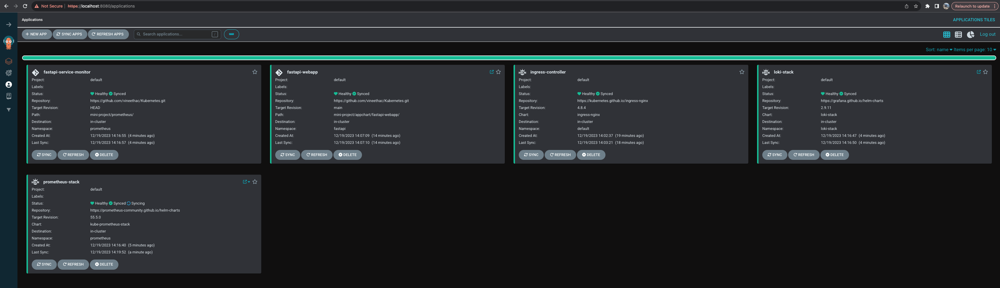

## Overview
In this exercise we will use Argo CD to deploy the apps we worked on in the [K8s mini project](https://github.com/vineethac/Kubernetes/tree/main/mini-project).

## Access to a K8s cluster
You should have access to a Kubernetes cluster. In my case, the kubeconfig file is `gc.kubeconfig`.
```
❯ KUBECONFIG=gc.kubeconfig kg no
NAME                                            STATUS   ROLES                  AGE   VERSION
tkc01-control-plane-k8fzb                       Ready    control-plane,master   19d   v1.23.8+vmware.3
tkc01-worker-nodepool-a1-pqq7j-76d555c9-4n5kh   Ready    <none>                 19d   v1.23.8+vmware.3
tkc01-worker-nodepool-a1-pqq7j-76d555c9-8pcc6   Ready    <none>                 19d   v1.23.8+vmware.3
tkc01-worker-nodepool-a1-pqq7j-76d555c9-rx7jf   Ready    <none>                 19d   v1.23.8+vmware.3
```

## Deploy Argo CD on the K8s cluster
Now lets deploy Argo CD to the K8s cluster.
```
❯ KUBECONFIG=gc.kubeconfig kubectl create namespace argocd
❯ KUBECONFIG=gc.kubeconfig kubectl apply -n argocd -f https://raw.githubusercontent.com/argoproj/argo-cd/stable/manifests/install.yaml
```
Reference: https://vineethac.blogspot.com/2022/06/gitops-using-argo-cd-part1.html

## Deploy different components of our project to the K8s cluster using Argo CD application resource
All the Argo CD app manifests are present in the `apps-manifest` directory. We can now deploy them.

### Ingress controller
```
❯ KUBECONFIG=gc.kubeconfig kubectl create -f apps-manifest/ingress-controller.yaml
```

### Prometheus stack
```
❯ KUBECONFIG=gc.kubeconfig kubectl create -f apps-manifest/prometheus-stack.yaml
```

### FastAPI web app
```
❯ KUBECONFIG=gc.kubeconfig kubectl create -f apps-manifest/fastapi-webapp.yaml
```

### FastAPI service monitor
```
❯ KUBECONFIG=gc.kubeconfig kubectl create -f apps-manifest/fastapi-service-monitor.yaml
```

### Loki stack
```
❯ KUBECONFIG=gc.kubeconfig kubectl create -f apps-manifest/loki-stack.yaml
```

## Verify
```
❯ KUBECONFIG=gc.kubeconfig kg apps -A
NAMESPACE   NAME                      SYNC STATUS   HEALTH STATUS
argocd      fastapi-service-monitor   Synced        Healthy
argocd      fastapi-webapp            Synced        Healthy
argocd      ingress-controller        Synced        Healthy
argocd      loki-stack                Synced        Healthy
argocd      prometheus-stack          Synced        Healthy
❯
❯ KUBECONFIG=gc.kubeconfig kg ing -A
NAMESPACE    NAME                                    CLASS   HOSTS                                 ADDRESS        PORTS   AGE
fastapi      fastapi-ing                             nginx   fastapi-vineethac-poc.test.com        10.216.24.45   80      11m
loki-stack   loki-stack-grafana                      nginx   grafana-loki-vineethac-poc.test.com   10.216.24.45   80      110s
prometheus   prometheus-stack-grafana                nginx   grafana-vineethac-poc.test.com        10.216.24.45   80      108s
prometheus   prometheus-stack-kube-prom-prometheus   nginx   prometheus-vineethac-poc.test.com     10.216.24.45   80      108s
❯
❯ cat  /etc/hosts | grep 10.216.24.45
10.216.24.45 fastapi-vineethac-poc.test.com
10.216.24.45 grafana-vineethac-poc.test.com
10.216.24.45 prometheus-vineethac-poc.test.com
10.216.24.45 grafana-loki-vineethac-poc.test.com
❯
❯
❯ curl fastapi-vineethac-poc.test.com
{"message":"welcome to using FastAPI"}%
❯ curl fastapi-vineethac-poc.test.com/date
{"date":"2023-12-19T08:49:04.289851"}%
❯ curl fastapi-vineethac-poc.test.com/testpage
{"message":"this is a test page"}%
❯ curl fastapi-vineethac-poc.test.com/metrics
# HELP welcome_count_total count of welcome api
# TYPE welcome_count_total counter
welcome_count_total 1.0
# HELP welcome_count_created count of welcome api
# TYPE welcome_count_created gauge
welcome_count_created 1.702975035399486e+09
# HELP testpage_count_total count of testpage api
# TYPE testpage_count_total counter
testpage_count_total 1.0
# HELP testpage_count_created count of testpage api
# TYPE testpage_count_created gauge
testpage_count_created 1.7029750353995094e+09
# HELP date_count_total count of date api
# TYPE date_count_total counter
date_count_total 1.0
# HELP date_count_created count of date api
# TYPE date_count_created gauge
date_count_created 1.7029750353995214e+09
```

You can just port-forward to access the Argo CD dashboard.
```
❯ KUBECONFIG=gc.kubeconfig kubectl port-forward -n argocd service/argocd-server 8080:443
```


