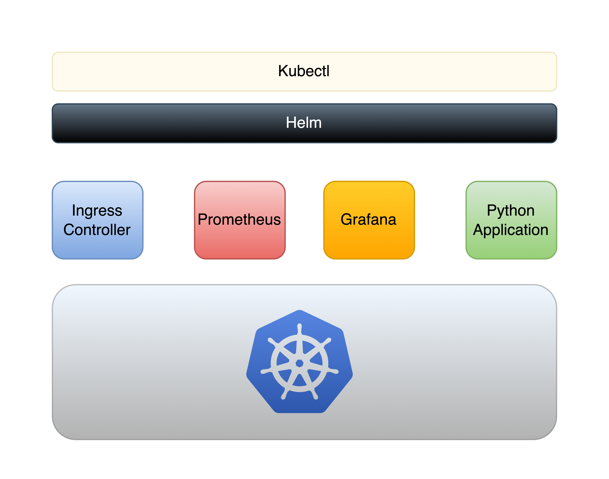
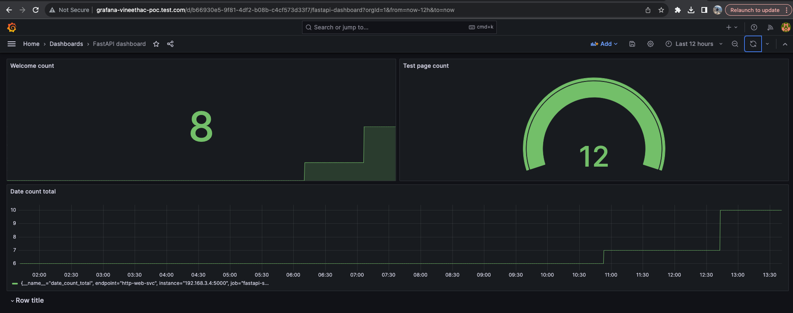
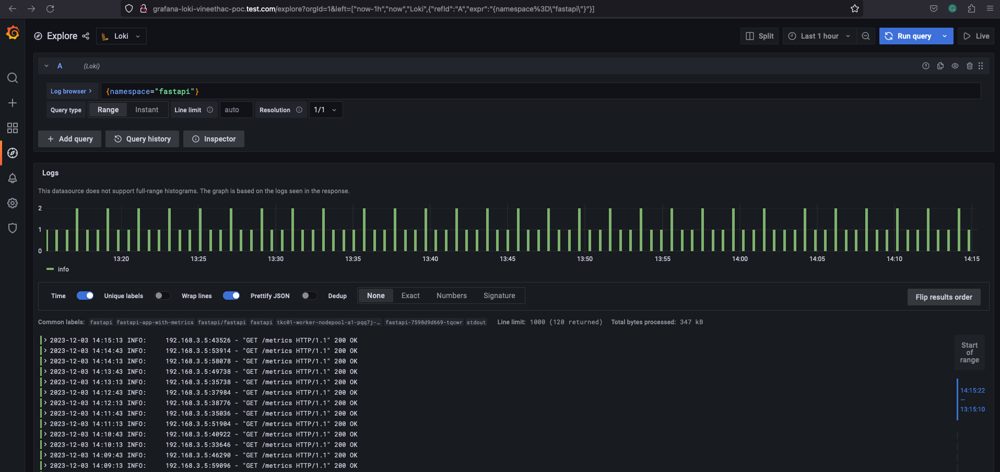

## Overview
* In this project a simple Python based web application will be deployed on a Kubernetes cluster.
* We make use of Helm to deploy this app to K8s.
* This web app also exposes some metrics using the Prometheus Python client.
* To store and visualize these metrics we will deploy Prometheus and Grafana in the K8s cluster.
* We will also deploy and use an ingress controller for exposing the web app, Prometheus, and Grafana to external users.
* For logging we will deploy Grafana Loki stack.

[](images/mini-project.png)

## Access to a K8s cluster
* Here `gc.kubeconfig` is the kubeconfig for the K8s cluster where we will deploy the app and monitoring components.

```
❯ KUBECONFIG=gc.kubeconfig kg no
NAME                                            STATUS   ROLES                  AGE    VERSION
tkc01-control-plane-k8fzb                       Ready    control-plane,master   144m   v1.23.8+vmware.3
tkc01-worker-nodepool-a1-pqq7j-76d555c9-4n5kh   Ready    <none>                 132m   v1.23.8+vmware.3
tkc01-worker-nodepool-a1-pqq7j-76d555c9-8pcc6   Ready    <none>                 128m   v1.23.8+vmware.3
tkc01-worker-nodepool-a1-pqq7j-76d555c9-rx7jf   Ready    <none>                 134m   v1.23.8+vmware.3
❯
```

## Deploy ingress controller
* Deploy ingress controller using Helm.
```
❯ helm repo add nginx-stable https://helm.nginx.com/stable
❯ helm repo update
❯ helm install nginx-ingress nginx-stable/nginx-ingress --set rbac.create=true --set controller.replicaCount=3 --set controller.image.repository="nginx/nginx-ingress" --kubeconfig=gc.kubeconfig 
```
* Verify.
```
❯ helm list --kubeconfig=gc.kubeconfig
WARNING: Kubernetes configuration file is group-readable. This is insecure. Location: gc.kubeconfig
WARNING: Kubernetes configuration file is world-readable. This is insecure. Location: gc.kubeconfig
NAME         	NAMESPACE	REVISION	UPDATED                            	STATUS  	CHART              	APP VERSION
nginx-ingress	default  	1       	2023-11-29 22:11:32.99048 +0530 IST	deployed	nginx-ingress-1.0.2	3.3.2
❯
❯ KUBECONFIG=gc.kubeconfig kg po
NAME                                        READY   STATUS    RESTARTS   AGE
nginx-ingress-controller-7d8bd5c488-559gj   1/1     Running   0          19s
nginx-ingress-controller-7d8bd5c488-9pbf5   1/1     Running   0          19s
nginx-ingress-controller-7d8bd5c488-mq5hs   1/1     Running   0          19s
❯
❯ KUBECONFIG=gc.kubeconfig kg deployments
NAME                       READY   UP-TO-DATE   AVAILABLE   AGE
nginx-ingress-controller   3/3     3            3           25s
❯
❯ KUBECONFIG=gc.kubeconfig kg svc
NAME                       TYPE           CLUSTER-IP      EXTERNAL-IP    PORT(S)                      AGE
kubernetes                 ClusterIP      10.96.0.1       <none>         443/TCP                      149m
nginx-ingress-controller   LoadBalancer   10.101.97.160   10.216.24.45   80:30244/TCP,443:30182/TCP   33s
supervisor                 ClusterIP      None            <none>         6443/TCP                     149m
❯
```

## Deploy the app to K8s cluster using Helm
* Our Python web app is placed in the app directory.
* We will create and use Helm chart to deploy this app into K8s.
* App will be deployed as a deployment object in K8s.
* A service of type ClusterIP will be used to expose this app internally within the K8s cluster.
* Then an ingress resource will be created to expose this app externally.
* Helm chart manifests are placed in appchart directory.
* I created a scaffolding first as shown below and then made changes to the files and values as per my requirements. You don't need to run the `helm create` step. This is just a note to explain how this Helm chart was created for the app.
```
❯ helm create fastapi-webapp
WARNING: Kubernetes configuration file is group-readable. This is insecure. Location: /Users/vineetha/.kube/config
WARNING: Kubernetes configuration file is world-readable. This is insecure. Location: /Users/vineetha/.kube/config
Creating fastapi-webapp
```

* Deploy the webapp on K8s using Helm. 
```
❯ helm upgrade --install --atomic fastapi-webapp appchart/fastapi-webapp --kubeconfig=gc.kubeconfig --create-namespace --namespace=fastapi --values appchart/fastapi-webapp/values.yaml
WARNING: Kubernetes configuration file is group-readable. This is insecure. Location: gc.kubeconfig
WARNING: Kubernetes configuration file is world-readable. This is insecure. Location: gc.kubeconfig
Release "fastapi-webapp" does not exist. Installing it now.
NAME: fastapi-webapp
LAST DEPLOYED: Thu Nov 30 17:01:10 2023
NAMESPACE: fastapi
STATUS: deployed
REVISION: 1
TEST SUITE: None
❯
```

* Verify.
```
❯ helm list --kubeconfig gc.kubeconfig -A
WARNING: Kubernetes configuration file is group-readable. This is insecure. Location: gc.kubeconfig
WARNING: Kubernetes configuration file is world-readable. This is insecure. Location: gc.kubeconfig
NAME          	NAMESPACE	REVISION	UPDATED                             	STATUS  	CHART               	APP VERSION
fastapi-webapp	fastapi  	1       	2023-11-30 17:01:10.724235 +0530 IST	deployed	fastapi-webapp-0.1.0	0.1.0
nginx-ingress 	default  	1       	2023-11-29 22:11:32.99048 +0530 IST 	deployed	nginx-ingress-1.0.2 	3.3.2
❯
❯
❯ KUBECONFIG=gc.kubeconfig kg deploy,pod,svc,ep,ing -n fastapi
NAME                      READY   UP-TO-DATE   AVAILABLE   AGE
deployment.apps/fastapi   1/1     1            1           3h10m

NAME                           READY   STATUS    RESTARTS   AGE
pod/fastapi-5dd5f46b56-dwx58   1/1     Running   0          82m

NAME                  TYPE        CLUSTER-IP       EXTERNAL-IP   PORT(S)    AGE
service/fastapi-svc   ClusterIP   10.106.147.228   <none>        5000/TCP   162m

NAME                    ENDPOINTS          AGE
endpoints/fastapi-svc   192.168.3.4:5000   162m

NAME                                    CLASS   HOSTS                            ADDRESS        PORTS   AGE
ingress.networking.k8s.io/fastapi-ing   nginx   fastapi-vineethac-poc.test.com   10.216.24.45   80      13m
❯
```

* Note: For the purpose of testing, I've added the ingress IP and hostname to my local `/etc/hosts` file in my Mac, so that name resolution works!
```
❯ cat /etc/hosts | grep 10.216.24.45
10.216.24.45 fastapi-vineethac-poc.test.com
❯
❯ ping fastapi-vineethac-poc.test.com
PING fastapi-vineethac-poc.test.com (10.216.24.45): 56 data bytes
64 bytes from 10.216.24.45: icmp_seq=0 ttl=46 time=281.215 ms
64 bytes from 10.216.24.45: icmp_seq=1 ttl=46 time=234.732 ms
^C
--- fastapi-vineethac-poc.test.com ping statistics ---
2 packets transmitted, 2 packets received, 0.0% packet loss
round-trip min/avg/max/stddev = 234.732/257.974/281.215/23.241 ms
❯
❯ curl fastapi-vineethac-poc.test.com
{"message":"welcome to using FastAPI"}%
❯
```

## Deploy Prometheus stack
* Prometheus stack related manifest files are placed under prometheus directory.
* I copied the `values.yaml` from https://github.com/prometheus-community/helm-charts/tree/main/charts/kube-prometheus-stack
* Enabled ingress, set `ingressClassName: nginx`, and provided hostnames for both Grafana and Prometheus in the `values.yaml` file.
* Deploy Prometheus monitoring stack to K8s using Helm.
```
❯ helm upgrade --install --atomic kube-stack-prometheus prometheus-community/kube-prometheus-stack --kubeconfig=gc.kubeconfig --values prometheus/values.yaml --create-namespace --namespace prometheus
WARNING: Kubernetes configuration file is group-readable. This is insecure. Location: gc.kubeconfig
WARNING: Kubernetes configuration file is world-readable. This is insecure. Location: gc.kubeconfig
Release "kube-stack-prometheus" does not exist. Installing it now.
NAME: kube-stack-prometheus
LAST DEPLOYED: Thu Nov 30 20:59:06 2023
NAMESPACE: prometheus
STATUS: deployed
REVISION: 1
NOTES:
kube-prometheus-stack has been installed. Check its status by running:
  kubectl --namespace prometheus get pods -l "release=kube-stack-prometheus"

Visit https://github.com/prometheus-operator/kube-prometheus for instructions on how to create & configure Alertmanager and Prometheus instances using the Operator.
```

* Verify.
```
❯ KUBECONFIG=gc.kubeconfig kg po -n prometheus
NAME                                                        READY   STATUS    RESTARTS   AGE
alertmanager-kube-stack-prometheus-kube-alertmanager-0      2/2     Running   0          13m
kube-stack-prometheus-grafana-776cccf9d5-f6kdq              3/3     Running   0          13m
kube-stack-prometheus-kube-operator-6fd66c88cb-mpqt9        1/1     Running   0          13m
kube-stack-prometheus-kube-state-metrics-7f7bb98646-n7whb   1/1     Running   0          13m
kube-stack-prometheus-prometheus-node-exporter-779rb        1/1     Running   0          13m
kube-stack-prometheus-prometheus-node-exporter-dcqxt        1/1     Running   0          13m
kube-stack-prometheus-prometheus-node-exporter-h42bs        1/1     Running   0          13m
kube-stack-prometheus-prometheus-node-exporter-rt2k6        1/1     Running   0          13m
prometheus-kube-stack-prometheus-kube-prometheus-0          2/2     Running   0          13m
❯
❯ KUBECONFIG=gc.kubeconfig kg ing -A
NAMESPACE    NAME                                    CLASS   HOSTS                               ADDRESS        PORTS   AGE
fastapi      fastapi-ing                             nginx   fastapi-vineethac-poc.test.com      10.216.24.45   80      76m
prometheus   kube-stack-prometheus-grafana           nginx   grafana-vineethac-poc.test.com      10.216.24.45   80      13m
prometheus   kube-stack-prometheus-kube-prometheus   nginx   prometheus-vineethac-poc.test.com   10.216.24.45   80      13m
❯
❯ KUBECONFIG=gc.kubeconfig kg servicemonitor -A
NAMESPACE    NAME                                                 AGE
prometheus   kube-stack-prometheus-grafana                        13m
prometheus   kube-stack-prometheus-kube-alertmanager              13m
prometheus   kube-stack-prometheus-kube-apiserver                 13m
prometheus   kube-stack-prometheus-kube-coredns                   13m
prometheus   kube-stack-prometheus-kube-kube-controller-manager   13m
prometheus   kube-stack-prometheus-kube-kube-etcd                 13m
prometheus   kube-stack-prometheus-kube-kube-proxy                13m
prometheus   kube-stack-prometheus-kube-kube-scheduler            13m
prometheus   kube-stack-prometheus-kube-kubelet                   13m
prometheus   kube-stack-prometheus-kube-operator                  13m
prometheus   kube-stack-prometheus-kube-prometheus                13m
prometheus   kube-stack-prometheus-kube-state-metrics             13m
prometheus   kube-stack-prometheus-prometheus-node-exporter       13m
❯
```

* You can see two ingress resources are created for Grafana and Prometheus as we enabled them in the `values.yaml` file.
* For the purpose of testing, I've added the ingress IP and hostname of Grafana and Prometheus to my local `/etc/hosts` file in my Mac, so that name resolution works!
```
❯ cat /etc/hosts | grep 10.216.24.45
10.216.24.45 fastapi-vineethac-poc.test.com
10.216.24.45 grafana-vineethac-poc.test.com
10.216.24.45 prometheus-vineethac-poc.test.com
❯
❯ ping grafana-vineethac-poc.test.com
PING grafana-vineethac-poc.test.com (10.216.24.45): 56 data bytes
64 bytes from 10.216.24.45: icmp_seq=0 ttl=46 time=337.247 ms
^C
--- grafana-vineethac-poc.test.com ping statistics ---
2 packets transmitted, 1 packets received, 50.0% packet loss
round-trip min/avg/max/stddev = 337.247/337.247/337.247/0.000 ms
❯
❯ ping prometheus-vineethac-poc.test.com
PING prometheus-vineethac-poc.test.com (10.216.24.45): 56 data bytes
64 bytes from 10.216.24.45: icmp_seq=0 ttl=46 time=232.026 ms
64 bytes from 10.216.24.45: icmp_seq=1 ttl=46 time=225.507 ms
^C
--- prometheus-vineethac-poc.test.com ping statistics ---
2 packets transmitted, 2 packets received, 0.0% packet loss
round-trip min/avg/max/stddev = 225.507/228.767/232.026/3.260 ms
❯
```
* http://grafana-vineethac-poc.test.com (opens Grafana home page. use admin prom-operator as username and password.)
* http://prometheus-vineethac-poc.test.com (opens Prometheus home page.)

## Create servicemonitor
* Create a `servicemonior` resource under prometheus namespace to scrape metrics from the flaskapp.
```
❯ KUBECONFIG=gc.kubeconfig k create -f prometheus/service-monitor-fastapi.yaml
servicemonitor.monitoring.coreos.com/fastapi-monitor created
❯
``` 
* This servicemonitor will look for services with matching label `app: fastapi` in the namespace `fastapi`. It will also look for the matching port name `http-web-svc`.

## Verify in Prometheus
* Now you can browse to the Prometheus home page and check targets. It sould be like:
```
serviceMonitor/prometheus/fastapi-monitor/0 (1/1 up)
```
* User Service Discover also you should see:
```
serviceMonitor/prometheus/fastapi-monitor/0 (1 / 1 active targets)
```
## Configure Grafana dashboards
* Create dashboard in Grafana for those 3 metrics exposed by the Python FastAPI application.
* You can also import the `grafana-fastapi-dashboard.json` provided in the prometheus directory.

## Verify the dashboard
* Simply curl multiple times to the Python application and observe the values in the dashboard.
```
❯ curl fastapi-vineethac-poc.test.com
❯ curl fastapi-vineethac-poc.test.com/testpage
❯ curl fastapi-vineethac-poc.test.com/date
```
* You also try to create cronjobs for the same instead of manually doing curl!



## Configure cronjobs to simulate the web application access
* TODO

## Logging
```
❯ helm repo add grafana https://grafana.github.io/helm-charts
❯ helm repo update
❯ helm repo list
❯ helm search repo loki
❯ helm show values grafana/loki-stack > loki-stack/values.yaml
```
* From the `loki-stack/values.yaml` I enabled Grafana by setting `enabled: true`. This will create a new Grafana instance.  
* I also added a section under `grafana.ingress` in the `loki-stack/values.yaml`, that will create an ingress resource for this new Grafana instace.
* Deploy loki-stack using Helm.
```
❯ helm upgrade --install --atomic loki-stack grafana/loki-stack --values loki-stack/values.yaml --kubeconfig=gc.kubeconfig --create-namespace --namespace=loki-stack
WARNING: Kubernetes configuration file is group-readable. This is insecure. Location: gc.kubeconfig
WARNING: Kubernetes configuration file is world-readable. This is insecure. Location: gc.kubeconfig
Release "loki-stack" does not exist. Installing it now.
W1203 13:36:48.286498   31990 warnings.go:70] policy/v1beta1 PodSecurityPolicy is deprecated in v1.21+, unavailable in v1.25+
W1203 13:36:48.592349   31990 warnings.go:70] policy/v1beta1 PodSecurityPolicy is deprecated in v1.21+, unavailable in v1.25+
W1203 13:36:55.840670   31990 warnings.go:70] policy/v1beta1 PodSecurityPolicy is deprecated in v1.21+, unavailable in v1.25+
W1203 13:36:55.849356   31990 warnings.go:70] policy/v1beta1 PodSecurityPolicy is deprecated in v1.21+, unavailable in v1.25+
NAME: loki-stack
LAST DEPLOYED: Sun Dec  3 13:36:45 2023
NAMESPACE: loki-stack
STATUS: deployed
REVISION: 1
NOTES:
The Loki stack has been deployed to your cluster. Loki can now be added as a datasource in Grafana.

See http://docs.grafana.org/features/datasources/loki/ for more detail.
```

* Verify.
```
❯ KUBECONFIG=gc.kubeconfig kg all -n loki-stack
NAME                                     READY   STATUS    RESTARTS   AGE
pod/loki-stack-0                         1/1     Running   0          89s
pod/loki-stack-grafana-dff58c989-jdq2l   2/2     Running   0          89s
pod/loki-stack-promtail-5xmrj            1/1     Running   0          89s
pod/loki-stack-promtail-cts5j            1/1     Running   0          89s
pod/loki-stack-promtail-frwvw            1/1     Running   0          89s
pod/loki-stack-promtail-wn4dw            1/1     Running   0          89s

NAME                            TYPE        CLUSTER-IP       EXTERNAL-IP   PORT(S)    AGE
service/loki-stack              ClusterIP   10.110.208.35    <none>        3100/TCP   90s
service/loki-stack-grafana      ClusterIP   10.104.222.214   <none>        80/TCP     90s
service/loki-stack-headless     ClusterIP   None             <none>        3100/TCP   90s
service/loki-stack-memberlist   ClusterIP   None             <none>        7946/TCP   90s

NAME                                 DESIRED   CURRENT   READY   UP-TO-DATE   AVAILABLE   NODE SELECTOR   AGE
daemonset.apps/loki-stack-promtail   4         4         4       4            4           <none>          90s

NAME                                 READY   UP-TO-DATE   AVAILABLE   AGE
deployment.apps/loki-stack-grafana   1/1     1            1           90s

NAME                                           DESIRED   CURRENT   READY   AGE
replicaset.apps/loki-stack-grafana-dff58c989   1         1         1       90s

NAME                          READY   AGE
statefulset.apps/loki-stack   1/1     91s

❯ KUBECONFIG=gc.kubeconfig kg ing -n loki-stack
NAME                 CLASS   HOSTS                                 ADDRESS        PORTS   AGE
loki-stack-grafana   nginx   grafana-loki-vineethac-poc.test.com   10.216.24.45   80      7m16s
❯
```

* Note: I've added the ingress IP and hostname to my local `/etc/hosts` file in my Mac, so that name resolution works!
```
❯ cat /etc/hosts | grep 10.216.24.45
10.216.24.45 fastapi-vineethac-poc.test.com
10.216.24.45 grafana-vineethac-poc.test.com
10.216.24.45 prometheus-vineethac-poc.test.com
10.216.24.45 grafana-loki-vineethac-poc.test.com
❯
```

* At this point you should be able to access the new Grafana instance for Loki at http://grafana-loki-vineethac-poc.test.com.
* You can get the username and password for this Grafana instace from the following secret:
```
❯ KUBECONFIG=gc.kubeconfig kg secrets -n loki-stack
NAME                               TYPE                                  DATA   AGE
default-token-fmp7v                kubernetes.io/service-account-token   3      7m37s
loki-stack                         Opaque                                1      7m35s
loki-stack-grafana                 Opaque                                3      7m35s
loki-stack-grafana-token-pvjhv     kubernetes.io/service-account-token   3      7m35s
loki-stack-promtail                Opaque                                1      7m35s
loki-stack-promtail-token-82vnk    kubernetes.io/service-account-token   3      7m35s
loki-stack-token-4s5sh             kubernetes.io/service-account-token   3      7m35s
sh.helm.release.v1.loki-stack.v1   helm.sh/release.v1                    1      7m36s
❯
❯ KUBECONFIG=gc.kubeconfig kg secrets -n loki-stack loki-stack-grafana -oyaml
apiVersion: v1
data:
  admin-password: VWJ0NFNweFRuYkI2TkdMcGM2VHpGT3hROFJiOTYxZkFiVURvbUpKcA==
  admin-user: YWRtaW4=
  ldap-toml: ""
kind: Secret
metadata:
  annotations:
    meta.helm.sh/release-name: loki-stack
    meta.helm.sh/release-namespace: loki-stack
  creationTimestamp: "2023-12-03T08:06:56Z"
  labels:
    app.kubernetes.io/instance: loki-stack
    app.kubernetes.io/managed-by: Helm
    app.kubernetes.io/name: grafana
    app.kubernetes.io/version: 8.3.5
    helm.sh/chart: grafana-6.43.5
  name: loki-stack-grafana
  namespace: loki-stack
  resourceVersion: "975894"
  uid: 0a3a8716-0616-405d-a84d-247a49af9977
type: Opaque
❯
❯ echo "VWJ0NFNweFRuYkI2TkdMcGM2VHpGT3hROFJiOTYxZkFiVURvbUpKcA==" | base64 -d
Ubt4SpxTnbB6NGLpc6TzFOxQ8Rb961fAbUDomJJp%
❯
❯ echo "YWRtaW4=" | base64 -d
admin%
```

* Login to the Grafana instance for Loki and verify the Data Sources section, and it must be already configured.
* Now click on explore option and use the log browser to query logs.
* If you enter `{namespace="fastapi"}` in the log browser and click on `Run query` option, you should be able to see logs from the `fastapi` namespace.

